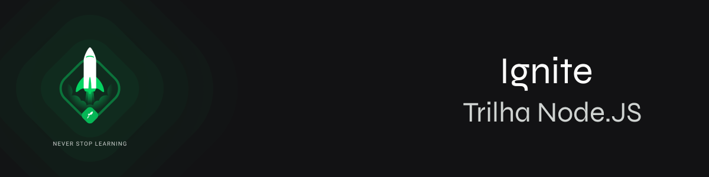

<h2 align="center">
  Ignite Node.js - Em andamento!
</h2>

  <a href="#Sobre">Sobre</a>&nbsp;&nbsp;&nbsp;|&nbsp;&nbsp;&nbsp;
  <a href="#Jornada">Jornada</a>&nbsp;&nbsp;&nbsp;&nbsp;&nbsp;&nbsp;

## Sobre
O Ignite é um programa feito pela [Rocketseat](https://rocketseat.com.br) de aceleração para devs, focado em preparar profissionais completos(as) para o mercado, treinando skills técnicas e comportamentais de forma intensiva e prática. O Ignite é dividido em trilhas de conhecimento não-dependentes onde nos aprofundamos em uma tecnologia específica. Em resumo, o objetivo do Ignite é desenvolver habilidades que vão acelerar sua carreira através de uma metodologia de aprendizado eficiente, um currículo alinhado às necessidades do mercado e as atitudes que vão te ajudar a se destacar como profissional.

## Jornada

**Capítulo 1 - Fundamentos do Node.js e primeiro projeto com Node.js**

  Nesse módulo nós conhecemos os conceitos do Node.js, como é o seu funcionamento e os motivos pelo qual ele foi criado. Iremos estudar sobre os conceitos e regras por trás de uma API Rest, os métodos HTTPs, os principais códigos de retornos e tipos de parâmetros de uma requisição.
E criamos nosso primeiro projeto com Node.js do total zero, colocando em prática todos os conceitos estudados no módulo inicial.

Desafios:

- [01 - Conceitos do Node.js](https://github.com/georgaugusto/nodechallenge01)
- [02 - Trabalhando com Middlewares](https://github.com/georgaugusto/nodechallenge02)
- [03 - Corrigindo o código](https://github.com/georgaugusto/nodechallenge03)

**Capítulo 2 - Iniciando a API**

  Aqui aprenderemos a criar aplicações utilizando TypeScript seguindo padrões de código e princípios do SOLID. Aprenderemos conceitos importantes como casos de uso, repositórios, models, streams do Node.js e documentação de APIs com Swagger.

Desafios:

- [01 - Introdução ao SOLID](https://github.com/georgaugusto/ignite-node-js)
- [02 - Documentando com Swagger](https://github.com/georgaugusto/ignite-node-js)

---

Feito com 💜 &nbsp;por Georg Augusto Schlegel 👋 &nbsp;[Mande um alô!](https://www.linkedin.com/in/georgaugusto/)
